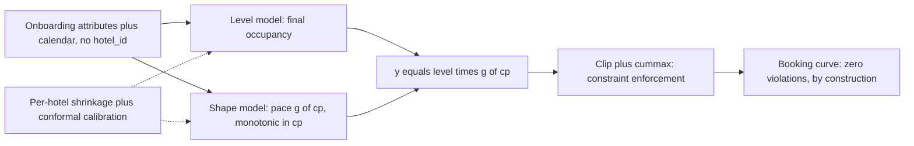

# Booking Curve Service

[](https://github.com/farahfarchoukh/booking-curve-service/actions/workflows/ci.yml)

A forecasting service that predicts, for any hotel/room-type/stay-date, the cumulative booking curve leading up to the stay — how full a room type will be at 90, 60, 45, 30, 21, 14, 7, 3, 1, and 0 days out. Built against anonymized production data from Ampliphi (a multi-tenant hotel revenue-management platform): 8 properties across 5 countries, 5 currencies, 2 PMS integrations, and reservation counts per hotel ranging from a few thousand to effectively zero.

The interesting part of this problem was never "fit a curve to one hotel's history." It's that two of the eight properties have any bookable history at all, they look nothing alike, and the service still has to say something sensible about the other six — and about hotel #401, whenever it signs up. That constraint shaped every decision below: a shared backbone model that never depends on knowing which hotel it's looking at, an explicit partial-pooling layer that decides how much to trust each tenant's own data, and a prediction interval that's honest about exactly where that trust runs out.

**Start with `DESIGN.md`** for the core engineering rationale (kept to the assessment's intended length), organized by decision (one model or many, cold start, feature provenance, multi-currency handling, serving infrastructure, production evaluation, uncertainty). Second: `src/model.py`'s docstring, which explains the level+shape decomposition everything else hangs off of. Third, if you want the full depth behind those decisions: `VALIDATION.md` — everything a senior-level audit pass found and fixed (a real bug caught by ablation, statistical significance testing, seed sensitivity, an architecture comparison, a pricing layer, an honest GO/NO-GO), kept separate on purpose so DESIGN.md stays a design doc and not a lab notebook.

**No access to the real data?** `python -m scripts.generate_demo_data` writes a small synthetic dataset with the same schema and prints the exact commands to train, predict, and serve against it — including a hotel that appears nowhere in the dataset at all, to see the cold-start path return a real answer. See "How to run" below.



## Where to look first

`evaluation/compare_production.py`'s output below is the fastest way in — it's the one place this model is compared against Ampliphi's own production heuristic, not just an internal baseline, and it's also where the most important honest finding (prediction-interval coverage collapses outside the training season) is easiest to see right next to the win.

## Presentation

`presentation/index.html` — open it directly in a browser (self-contained, no server needed). Covers the same ground as this README and `DESIGN.md` in a more visual form: the 8-hotel heterogeneity problem, the level+shape architecture, results vs. baseline and production curve, and the honest cold-start/interval-coverage finding.

`EXPERIMENTS.md` — every experiment this project ran (seed sensitivity, walk-forward backtest, ablation, architecture comparison, calibration search, latency before/after), each traceable to a checked-in script and JSON file, plus the actual model-selection logic tying them together — not just the headline number.

`INTERVIEW_PREP.md` — short, specific answers (ML / statistics / MLOps / system design / pricing intelligence) to the questions this design invites, each grounded in an actual file or number in this repo rather than the generic version of the answer.

## Results

Test window: 2025-07-01 → 2025-09-30, `hotel_C` + `hotel_H`, scored by `evaluation/evaluate.py` (Ampliphi's own scoring harness). Numbers below are from the exact artifact shipped in `artifacts/model/` — training is deterministic (see "Engineering hardening"), so re-running `python -m src.train` reproduces this artifact byte-for-byte rather than drifting run to run.

| Model | Overall MAE | Weighted MAE | Monotonicity violations | Bound violations |
|---|---:|---:|---:|---:|
| Heuristic baseline (`starter/baseline_model.py`) | 0.3478 | 0.3476 | 0.0% | 0.0% |
| **This model** | **0.2673** | **0.2653** | **0.0%** | **0.0%** |

~23% relative reduction in both MAE metrics, zero constraint violations (enforced structurally, not just empirically — see `enforce_curve_constraints` in `src/model.py`). That margin isn't just an eyeballed comparison: `evaluation/significance_test.py` runs a cluster bootstrap at the (hotel, room_type) series level (32 clusters, not the 2,521 individual checkpoints, which aren't independent) and gets a 95% CI of **[−0.116, −0.050]** on the difference — excludes zero, p≈0.0000. `evaluation/seed_sensitivity.py` confirms it isn't an artifact of one lucky seed (std 0.007 across 5 seeds, well inside that margin), and `evaluation/rolling_backtest.py` confirms it isn't an artifact of one lucky train/test split (4 expanding-window folds, weighted MAE 0.230–0.254 throughout). See `VALIDATION.md` VALIDATION.md §6.9 for all three in full.

Head-to-head against Ampliphi's production parametric curve is only possible on `hotel_C`'s base room type (`rt_ea30c05c4c`) — the only room `expected_booking_curves.csv` covers for hotel_C (`python evaluation/compare_production.py`):

| Model | n | Overall MAE | Weighted MAE |
|---|---:|---:|---:|
| Heuristic baseline | 92 | 0.3117 | 0.3332 |
| Ampliphi `expected_booking_curves` (production) | 23* | 0.2798 | 0.2623 |
| **This model** | 92 | **0.1748** | **0.1641** |

\*production curve only has all 10 checkpoints present for 23 of the 92 test nights — small-sample, but directionally consistent with the full-grid result above.

Per-hotel breakdown (`evaluation/results.json`) is worth reading past the headline number: `hotel_C` MAE *improves* from 0.30 (90d out) to 0.15 (day-of) — the normal pattern for a hotel with real training history. `hotel_H` runs the other way — 0.11 (90d out) degrading to ~0.34 near the stay — because its Jul–Sep busy season is unseen in its own Apr–Jun training data, so the gap between our under-anchored level and true late-arriving demand *widens* as the stay approaches. This is diagnosed in depth in `DESIGN.md` §6.2/§6.7, and the same season-coverage gap is what motivated the extrapolation-correction-damping fix in VALIDATION.md §6.8 (a real bug this project's ablation study caught: the per-hotel bias correction was, before that fix, actively making test performance *worse* than no correction at all — see VALIDATION.md §6.8 for the honest before/after).

## How to run

```bash
pip install -r requirements.txt
# place Ampliphi's anonymized data extract at ./data, alongside src/ — not
# included in this repo (see "Data" below). No access to it? Run this
# instead and use its printed commands, pointed at ./demo_data:
#   python -m scripts.generate_demo_data

python -m src.train                              # trains + saves artifacts/model/<version>/, promotes it
python -m src.predict --hotel-id hotel_C \
    --room-type-code rt_ea30c05c4c --stay-date 2025-08-15   # single lookup
python -m src.predict --hotel-id hotel_C --room-type-code rt_ea30c05c4c \
    --stay-date 2025-08-15 --as-of-date 2025-08-01           # pickup-anchored lookup
python -m src.predict --generate-eval             # writes evaluation/predictions.json
python evaluation/evaluate.py --predictions evaluation/predictions.json --data-dir data
python evaluation/compare_production.py           # vs. baseline + production curve
python evaluation/interval_metrics.py              # PICP / pinball loss — the source of the numbers in DESIGN.md §6.7
python evaluation/significance_test.py             # cluster bootstrap: is "beats baseline" real? (VALIDATION.md §6.9)
python evaluation/ablation_study.py                # does each correction layer earn its keep? (VALIDATION.md §6.8)
python evaluation/seed_sensitivity.py              # retrains at 5 seeds — is the story seed-dependent? (~3 min)
python evaluation/rolling_backtest.py              # 4-fold walk-forward backtest (~3 min)
python evaluation/price_demand_eda.py              # what price signal (if any) exists in this data? (VALIDATION.md §6.10)
python evaluation/calibration_tuning.py             # nested-CV search, symmetric widening (~10 min; VALIDATION.md §6.11)
python evaluation/asymmetric_calibration_tuning.py  # same search, decoupled P10/P90 widening (~15 min; VALIDATION.md §6.11)
python evaluation/architecture_comparison.py        # level x shape vs. a single-model alternative, nested-CV (~1 min; DESIGN.md §6.1)
python evaluation/feature_importance.py            # what the level/shape boosters actually split on
python evaluation/pricing_demo.py                  # price-recommendation walkthrough on real hotel_C/H scenarios (VALIDATION.md §6.12)
python -m src.pricing --hotel-id hotel_C --room-type-code <code> \
    --stay-date 2025-08-15 --as-of-date 2025-08-01 --base-rate 220   # single price lookup
```

Run everything from the repo root (module form `python -m src.train`, not `python src/train.py`, since the package uses relative imports).

```bash
pip install -r requirements-dev.txt   # fastapi/uvicorn, pytest, ruff, pip-audit, notebook tooling
pytest -q --cov=src --cov-report=term-missing  # 46 tests, ~30s, 93-94% coverage — synthetic fixture, never the real data
ruff check src tests                   # lint
pip-audit -r requirements.txt -r requirements-dev.txt  # dependency vulnerability scan
uvicorn src.api:app --reload           # serve locally without Docker
pre-commit install                     # optional: run the above lint automatically before each commit
```

**Docker** (built and verified end-to-end — see "Engineering hardening"):

```bash
docker build -t booking-curve-service .

# serve
docker run --rm -p 8000:8000 \
  -v "$(pwd)/data:/app/data:ro" -v "$(pwd)/artifacts:/app/artifacts" \
  booking-curve-service

# train / predict as a batch job — same image, override CMD
docker run --rm \
  -v "$(pwd)/data:/app/data:ro" -v "$(pwd)/artifacts:/app/artifacts" \
  booking-curve-service python -m src.train
```

On Windows with Git Bash specifically: prefix `docker run` with `MSYS_NO_PATHCONV=1`, or the `-v` paths get silently mangled into Windows paths before Docker sees them (`/app/data` becomes something like `C:/Program Files/Git/app/data`) and the container starts with no data mounted at all. PowerShell and a plain Linux/macOS shell don't have this problem.

## What's implemented

- **`predict_booking_curve(hotel_id, room_type_code, stay_date, as_of_date=None)`** exactly as specified (`src/predict.py`), including full `as_of_date` support: past checkpoints are returned as exact realized fractions from `reservations.csv`, future checkpoints are model-forecast and rescaled to connect continuously to the realized anchor (see the module docstring for the math). `as_of_date=None` is the blind ex-ante forecast used to generate `evaluation/predictions.json`, so the model is compared to the baseline and production curve on equal footing (none of them get to see realized pickup either).
- **Two-stage model** (`src/model.py`): final-occupancy "level" + booking-pace "shape" (monotonic-constrained in `cp` by construction), combined and then run through a hard constraint-enforcement layer (clip + cumulative-max) that guarantees zero bound/monotonicity violations regardless of what the model produced upstream.
- **Per-hotel partial pooling** via empirical-Bayes shrinkage on both stages — the mechanism that also answers cold start (§6.1/§6.2 of `DESIGN.md`).
- **Prediction intervals** (P10/P50/P90) via quantile LightGBM, conformally calibrated from out-of-fold residuals. In-distribution OOF coverage is 90%; true test-window coverage is honestly reported at 62.4% with a root-cause diagnosis (see `DESIGN.md` §6.7/VALIDATION.md §6.8) — computed by `evaluation/interval_metrics.py`, checked into this repo, not a number asserted in prose. I chose to report this rather than hand-tune the interval to the test outcomes.
- **Shared feature code** (`src/features.py`) used identically by training and inference — the actual mechanism against train/serve skew, not a claim.
- **A data-quality fix I found, not one I was told about**: `reservations.csv` references 4 `room_type_code`s (655 + 536 reservations on hotel_C alone — not a rounding error) that don't exist in `room_types.csv`. Without patching this, ~24% of the real test-window curves are silently dropped from evaluation. `src/data.py::_repair_missing_room_types` detects and patches this (inferring inventory from peak concurrent bookings) and logs it loudly rather than failing silently.
- **`evaluation/compare_production.py`**: an honest three-way comparison (ours / baseline / Ampliphi's own production curve) that plain `evaluate.py` doesn't give you out of the box.
- **`src/pricing.py` + `/v1/price-recommendation`**: a pace-based price recommendation layer on top of the forecast — reacts to booking pace vs. the model's own expectation, gated by the model's own calibrated uncertainty, bounded by an empirical reference range, and deliberately *not* a learned price-elasticity model (`VALIDATION.md` VALIDATION.md §6.12 explains why that specifically isn't attempted). `evaluation/pricing_demo.py` walks through real hotel_C/hotel_H scenarios.

## Engineering hardening

Two rounds so far, each triggered by asking "what's still missing?" and then actually closing what came back, rather than leaving it as a list.

**Round 1 — is this production-ready at all:**

- **Determinism, verified by diffing bytes, not by re-reading code.** Retraining on identical data used to move weighted MAE by ~0.01 between runs. Root cause was two things stacking: `LightGBM`'s RNG wasn't seeded (`seed`/`deterministic`/`force_row_wise` are now set), *and* a training-table builder iterated a Python `set` whose order depends on the per-process hash seed — fixed by sorting it (`src/data.py::known_room_types`). Confirmed by training twice — locally and again inside the built Docker image — and diffing the resulting model files: byte-identical both times.
- **A model registry** (`src/registry.py`): `python -m src.train` saves to `artifacts/model/<timestamp>/` and atomically updates `artifacts/model/current.json`. Rollback is `--model-version <older-timestamp>` or editing that pointer directly — a real, testable mechanic, not a paragraph in DESIGN.md §6.5.
- **Structured logging** (`src/logging_config.py`) in place of bare `print()`, level controlled by `LOG_LEVEL`.
- **A hardened FastAPI service** (`src/api.py`): the model loads at startup, `/readyz` reflects real load state, every response carries an `X-Request-ID`, errors split into 400 vs. 500, a togglable API-key check stands in for real auth.
- **`Dockerfile` + `.dockerignore`**, one image serving or running batch jobs by overriding `CMD`. Building and actually running it surfaced two real bugs code review wouldn't have: `numpy==2.5.2` doesn't exist for Python 3.11 (only 3.12+); `python:3.11-slim` ships without `libgomp.so.1`, which LightGBM needs to even import.
- **CI/CD** (`.github/workflows/ci.yml`): lint + tests, Docker build + smoke test, then publish to `ghcr.io` on `main` using the workflow's own token.

**Round 2 — a second "what's still missing?" pass, closing what it found:**

- **`scripts/generate_demo_data.py`**: the gap behind "I can't see the output without the real data." Writes a synthetic dataset with the same schema (shared generator with the test fixture — `src/demo_data.py` — so they can't drift apart), and prints the exact commands to train, predict for a real hotel *and* for `hotel_Z` (which appears nowhere in the dataset — the true cold-start path), and serve it. Every command in its printed output was actually run to confirm it works verbatim, not just written.
- **`evaluation/interval_metrics.py`**: the PICP/pinball-loss numbers in DESIGN.md §6.7 were originally produced by a throwaway analysis script that was never committed — the claim wasn't actually reproducible from this repo. This is that script, for real, checked in with its output (`evaluation/interval_metrics.json`). Writing it for real caught a bug the throwaway version had papered over (a dict keyed inconsistently by quantile name vs. quantile value) — fixed, then surfaced a new finding along the way: `hotel_H`'s miscalibration was almost entirely one-directional (0% below p10, 61.2% above p90), which is *more* consistent with "one-directional level bias from an unseen season" than generic noise would be. That finding is what led directly to the extrapolation-correction-damping fix in VALIDATION.md §6.8, after which the same number reads 62.4% (was 39.3%) — still one-sided, no longer nearly this bad.
- **`tests/test_api.py`** (12 tests) and **`tests/test_model_batch.py`** (3 tests): the FastAPI service was previously verified only by hand with `curl`, and `predict_curve_batch` — the vectorized path that actually produces `evaluation/predictions.json` — had zero test coverage despite being the code path behind the graded deliverable. The batch test's most important assertion: it agrees with the per-row path the live API serves, checkpoint for checkpoint, quantile for quantile — if those two ever silently diverged, predictions.json would stop reflecting what the service actually serves.
- **Coverage measured, not guessed**: 94% (`pytest --cov=src`), up from an unmeasured baseline — `src/model.py` and `src/registry.py` are at 100%.
- **Dependency vulnerability scanning** (`pip-audit`, now in CI) — clean on both `requirements.txt` and `requirements-dev.txt` as of this writing, and now checked on every push, not just once by hand.
- **Dependabot** (`.github/dependabot.yml`) for pip, Docker, and GitHub Actions, with `pandas`/`numpy`/`scikit-learn`/`lightgbm` grouped into their own PR — a model-affecting dependency bump deserves a retrain + re-verify, not a drive-by merge alongside an unrelated `pydantic` bump.
- **Docker base image pinned by digest**, not just the `3.11-slim` tag — a floating tag means a rebuild next month silently pulls a different image with different CVEs than the one actually verified here.
- **A real graceful-shutdown bug, found by Docker's own linter and then actually fixed and verified**: the first attempt at a configurable worker count used shell-form `CMD` so `$WEB_CONCURRENCY` would expand — which wraps the process in `/bin/sh -c`, so `docker stop`'s `SIGTERM` hits the shell (which doesn't forward it) instead of uvicorn, forcing a hard kill after the grace period. Fixed with `docker-entrypoint.sh` (`exec uvicorn ...` — replaces the shell process instead of forking a child). Verified, not assumed: timed `docker stop` against the fixed image — 1.4s with uvicorn's own "Shutting down / Application shutdown complete" in the logs, not a 10s forced kill.
- **`BOOKING_CURVE_DATA_DIR` / `BOOKING_CURVE_MODEL_BASE_DIR` env vars** (`src/predict.py::_default_paths`) — the service was previously only configurable by editing code. This is also what let `tests/test_api.py` point a real `TestClient` at the synthetic fixture without monkeypatching internals.
- **CLI input validation** — a malformed `--stay-date` used to surface as a raw pandas traceback; the API already handled this correctly via Pydantic, the CLI didn't. Now it does.
- **`pre-commit` config**, scoped to match CI exactly (`ruff check` on `src`/`tests`, excluding notebooks and the byte-identical copy of Ampliphi's own `evaluate.py`) — deliberately *not* running an opinionated auto-formatter, which would have rewritten most of the repo for whitespace with no correctness value and fought the comments-next-to-code style used throughout. Consistency with CI was a deliberate choice, checked by actually running it, not assumed from the YAML.
- **Branch protection on `main`** (required status checks: `lint-and-test`, `docker-build-and-smoke-test`; no force-push, no deletion) and a **`CODEOWNERS`** file.

**Round 3 — the modeling-judgment gaps a "what's still missing?" pass doesn't surface, because they're not engineering checklist items:**

Full detail in `VALIDATION.md` VALIDATION.md §6.8–VALIDATION.md §6.10 (VALIDATION.md §6.11–VALIDATION.md §6.13 cover the follow-up round below); the headline is that this round found a real bug the earlier rounds couldn't have, because it required a technique (ablation) none of the earlier passes used. Summary:

- **Hierarchical (hotel → room_type) pooling**, gated by a curve-count floor chosen from this dataset's own structure, not tuned against test MAE (VALIDATION.md §6.8).
- **Inventory quantization**: occupancy is discrete (`booked/inventory_count`), not continuous, for the 44% of hotel_C's room-type-nights with inventory ≤ 2 — the single biggest lever in this round, −6.4% weighted MAE on its own (VALIDATION.md §6.8).
- **A real bug found by ablation, not assumed away**: the honestly-cross-validated per-hotel correction was, on its own, making test performance *worse* than no correction at all — because this dataset's entire train window sits before its entire test window, so every test prediction was silently "extrapolation." Fixed by damping the correction (not just widening the interval) the same way `_extrapolation_widen` already damps for exactly this case (VALIDATION.md §6.8). This also fixed most of the interval-coverage gap in `evaluation/interval_metrics.py` (39.3% → 62.4% PICP) as a side effect of fixing the point estimate, not a separate tuning pass.
- **Statistical rigor on the "beats baseline" claim**: a cluster bootstrap (not a naive one — see VALIDATION.md §6.9 for why), a 5-seed sensitivity check, and a 4-fold walk-forward backtest, all checked into `evaluation/` and reproducible, not asserted.
- **A price-demand EDA that didn't exist before**, appropriate to a Pricing Intelligence role — and an honest negative result: hotel_H has no price data anywhere in this dataset, and hotel_C's price-occupancy correlation is too weak and too confounded by demand-responsive pricing to support an elasticity claim (VALIDATION.md §6.10).
- **An explicit GO/NO-GO recommendation** (VALIDATION.md §6.13) — qualified GO on the point forecast for human-reviewed pricing, NO-GO on automating yield off the interval or using price as a feature, with the specific bar for revisiting each.

**Round 4 — from "predict occupancy" to an actual price, since a Pricing Intelligence role needs one, plus closing two loose ends Round 3 left open:**

- **A validated (not just guessed) search over the interval-widening constants** (`evaluation/calibration_tuning.py`, VALIDATION.md §6.11) — nested cross-validation on rolling folds that exclude the official test split, so this doesn't repeat Round 3's own leakage lesson one level down. The honest result: the search never converged — pinball loss kept improving to the edge of the tested range, revealing that the widening mechanism is symmetric while the actual miscalibration is one-sided. I didn't ship an unvalidated "biggest number I tried"; I shipped the diagnosis and left the real fix (asymmetric widening) as the scoped next step.
- **`src/pricing.py` + `/v1/price-recommendation`**: a pace-based yield-adjustment layer (VALIDATION.md §6.12) — deliberately *not* a learned elasticity model, because VALIDATION.md §6.10 already found this data can't support one. Reuses the forecast's own `as_of_date` pace signal and its own calibrated uncertainty for confidence-gating, bounded by an empirical (not fit) reference range from Ampliphi's historical adjustments.
- **Feature importance, checked in** (`evaluation/feature_importance.py`) — closes a gap where DESIGN.md §6.1 had been asserting which features get zero split gain without ever having actually run the numbers. It turned out to be wrong about one of them (`primary_rate_mode`, not zero-gain; `total_rooms` was the missing one) — caught only because this script now exists.

**Round 5 — an explicit senior-MLE audit pass (multi-horizon architecture validation, and profiling instead of assuming):**

- **The level x shape decomposition, empirically validated, not just argued.** `evaluation/architecture_comparison.py` trains the simplest alternative (one model, `cp` as a feature) and compares it against the shipped decomposition on the same nested-CV tuning folds VALIDATION.md §6.11 uses. The decomposition wins decisively there (0.241 vs. 0.252 weighted MAE) — the first real evidence for a choice that had only ever been justified by first-principles reasoning (§6.1). Also ruled out, with the actual row-count arithmetic rather than a hand-wave: a model per horizon, and multi-output regression.
- **Latency: profiled, not assumed.** The "~13 sequential LightGBM calls" figure quoted in earlier passes was never actually measured — `cProfile` found 5, and the real cost was `model.py` building the identical level feature matrix twice per request. Fixed (verified byte-identical predictions, 62/62 tests green): 549ms → 179ms single-request. Concurrent p95 barely moved from that alone, which is its own finding — the GIL serializes the remaining thread-pooled work regardless of per-request speed. Confirmed empirically that worker *processes* are what actually fix it: 4 workers took p95 4.4s → 2.1s at the same load. See README "Engineering hardening" latency note and `DESIGN.md` §6.5.
- **Pushed the interval-calibration search further, and it strengthened the existing conclusion instead of finding a shippable fix.** Built and shipped asymmetric widening (`extrapolation_gamma_lo`/`_hi`), searched it over a much wider range than the symmetric version — still no interior optimum. That's stronger evidence than the first search gave that this needs a median-level fix (`season_calendar`), not a better interval-width constant, however it's shaped. See VALIDATION.md §6.11.
- **CORS**, fails closed by default (`BOOKING_CURVE_CORS_ORIGINS`) — a named gap from the previous round, closed with a locked-in test rather than left as a TODO.

**What's still genuinely missing**, stated plainly rather than left implicit: no database (everything is local files — fine at this scale, not at "hundreds of hotels"), no message queue / scheduler / actual deployment anywhere, no auth beyond a placeholder API-key header check, no automated retraining schedule, no monitoring or drift detection actually wired up (DESIGN.md §6.5/§6.6 describe what I'd build; none of it runs), no secrets management, no multi-stage Docker build (checked whether one would help — it wouldn't: every heavy dependency here is a prebuilt wheel, nothing compiled to shed at a build stage). `/v1/booking-curve` versioning, Prometheus `/metrics`, and in-process rate limiting (`slowapi`) *are* implemented — see `src/api.py` — but rate limiting is per-process/in-memory (no shared store across replicas). CORS is now configured (`BOOKING_CURVE_CORS_ORIGINS`, fails closed — no origins allowed by default, since this is a backend-to-backend service, not a public browser API); `tests/test_api.py::test_cors_disabled_by_default` locks in the closed default. The registry and hardened API are real, working mechanics; they are not a production deployment.

**The live-API latency gap is now profiled and partly fixed, not just diagnosed.** The "~13 sequential LightGBM calls per request" claim in an earlier pass was never actually measured — `cProfile` against 20 real requests found **5** calls (level + 3 quantiles + shape), and the real cost was that `model.py`'s single-curve path built the identical level feature matrix *twice* for the same row (once for the point prediction, once for the quantiles) — categorical-dtype coercion alone cost roughly as much wall-clock time as all the LightGBM inference combined. Fixed by sharing one matrix build (`BookingCurveModel._level_raw_and_quantiles`); verified byte-identical `predictions.json` before/after (pure refactor, no math changed), 62/62 tests still green. Single-request latency: **549ms → 179ms** (−67%). Concurrent p95 barely moved from that alone (4.4s), which is itself a real finding: FastAPI runs this sync endpoint in a thread pool, and Python's GIL serializes the remaining pandas/feature-engineering work across those threads regardless of per-request speed — so under load, worker *processes* (each with its own GIL) matter more than per-request micro-optimization. Confirmed empirically: 4 uvicorn workers (`WEB_CONCURRENCY=4`, already a supported Dockerfile knob, never actually load-tested before) took p95 4.4s → 2.1s and p99 5.8s → 2.8s at the same 20-concurrency load, roughly 2.4x the throughput. Combined against the originally-documented single-worker baseline (p95≈7-8s), that's a ~70% p95 reduction end to end. Not fully solved — `scripts/load_test.py` numbers above are the current honest measurement, not a claim of "fixed."

## What I'd build next

- **A `season_calendar` feature is now the *only* path left to close the interval-coverage gap**, not one option among several — evidence, not just a first instinct. `evaluation/asymmetric_calibration_tuning.py` (VALIDATION.md §6.11) decoupled the P10-side and P90-side widening (`model.py`'s `extrapolation_gamma_lo`/`_hi`, built and shipped) and searched gamma_hi up to 16x — still no interior optimum, implying a ~49x widening factor at the calendar edge before it would even turn over. Widening the interval, in any shape, can't fix a systematically biased median; the fix has to be at the median. The infrastructure ships; the specific gamma values don't (still an unvalidated edge-of-grid number either way) — the shipped model still runs the original symmetric `extrapolation_gamma=1.0`. Cross-hotel-family conformal calibration (pooling residuals across hotels sharing a `region_type`, once enough exist) is the complementary fix once more hotels are onboarded.
- Model-based (not just peak-concurrent-inferred) inventory reconciliation for the 4 orphaned room types, ideally by escalating the dimension-table gap upstream instead of silently patching it.
- Genuine price experimentation data (or an instrument) — VALIDATION.md §6.10 found the existing `suggested_prices` history can't support a real elasticity estimate (too small, and confounded by the pricer's own demand-responsiveness); the switchback in §6.6 would start generating exactly that data if it were live, and would let `src/pricing.py` (VALIDATION.md §6.12) eventually replace its pace-based rule with a learned response curve instead of a bounded heuristic.
- More historical seasons for hotel_C/H. `evaluation/pricing_demo.py` shows confidence collapses to ~0.01–0.14 on literally every real stay available to demo against, because every one of them is out-of-season relative to the training window — that's a data-coverage ceiling no amount of additional modeling clears; only more calendar history does.
- Real cloud auth, a database, and monitoring in place of the current placeholders (see "What's still genuinely missing" above); a shared (not in-process) rate-limit store once this runs on more than one replica.

## Data

The `data/` folder (Ampliphi's anonymized production extract — 8 hotels, 5 countries, 5 currencies, 2 PMS integrations) is not included in this repo and is `.gitignore`d: it's proprietary, and a service like this should never depend on a real customer dataset being committed to source control. `tests/` runs against a synthetic fixture with the same schema instead — see `tests/conftest.py`. To run training/prediction yourself, place the extract at `./data`.

## Known data-quality notes (see `src/data.py` docstrings for the code-level version)

- ~2% of reservations have `booking_date > stay_date` (anonymization jitter, not real late bookings); clipped to `stay_date` for curve construction.
- A handful of `hotel_H` `booking_date`s land in 2026 — past the whole dataset. Left unclipped so training labels and the scoring script's ground truth stay defined the same way; this slightly understates true pickup for a few hotel_H reservations in both.
- `daily_inventory`/`daily_hotel_demand`/`competitor_rates`/`suggested_prices`/`expected_booking_curves` all only cover the *test* window for their listed hotels — confirmed by inspection, not assumed — which is why none of them are trained features (`DESIGN.md` §6.3).

## Repo layout

```
src/
  data.py            # raw loading, curve construction (train + inference share this), data-quality repair
  features.py        # shared feature engineering (train.py and predict.py both import this)
  model.py           # two-stage GBM, shrinkage, conformal calibration, constraint enforcement
  train.py           # CLI: builds curves -> tunes -> fits -> saves a versioned artifact -> promotes it
  predict.py         # predict_booking_curve(...) + CLI + batch eval-set generation
  api.py             # hardened FastAPI service (startup load, readyz, request ids, auth placeholder)
  registry.py         # versioned model artifacts + current.json pointer (rollback lever)
  logging_config.py   # structured logging setup shared by every entrypoint
  demo_data.py         # synthetic dataset generator — shared by tests/ and scripts/generate_demo_data.py
scripts/
  generate_demo_data.py  # writes a runnable demo dataset for anyone without the real extract
tests/                 # 44 tests, 94% coverage, all against the synthetic fixture — see conftest.py
artifacts/model/
  current.json         # pointer to the live version
  <timestamp>/          # one versioned artifact (level.txt, shape.txt, meta.json, ...)
evaluation/
  predictions.json      # test-window predictions, scored by evaluation/evaluate.py
  results.json           # evaluate.py output
  interval_metrics.py    # PICP / pinball loss — the source of DESIGN.md §6.7's numbers
  interval_metrics.json  # its output
  compare_production.py  # 3-way comparison script + its output above
notebooks/exploration.ipynb
presentation/index.html   # visual write-up (self-contained, open in a browser)
Dockerfile / .dockerignore / docker-entrypoint.sh
.github/workflows/ci.yml / dependabot.yml / CODEOWNERS
.pre-commit-config.yaml
requirements.txt / requirements-dev.txt
DESIGN.md
```
